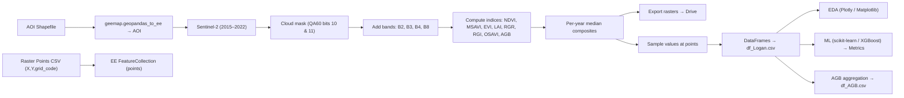

# Quantifying Above-Ground Biomass (AGB) from Sentinel-2 Indices with Google Earth Engine & ML

This project estimates **Above-Ground Biomass (AGB)** for the **Griffith University Logan Campus Arboretum** (AOI) using **Sentinel-2** imagery. It:
- computes multiple **vegetation indices** in **Google Earth Engine (GEE)**,
- **exports** rasters per index/year,
- **samples** index values at survey points,
- stacks results into tidy **CSV datasets**,
- visualizes temporal patterns, and
- trains baseline **ML regressors** to predict AGB.

> Notebook: `AGB_Indices_Download_Visualization_and_ML_Updated.ipynb`

---

##  Highlights

- **Indices computed (Sentinel-2):** `NDVI`, `MSAVI`, `EVI`, `LAI`, `RGR`, `RGI`, `OSAVI`
- **AGB proxy band:** `AGB = 14.046 + 272.496 × RGI` *(empirical model; see references)*
- **Years covered:** 2015–2022 (per-year median composites, cloud-masked)
- **AOI:** Shapefile (digitized in GIS; converted to EE FeatureCollection)
- **Sampling:** Point CSV (X/Y, grid_code) → values sampled from index rasters
- **Exports:**
  - GeoTIFFs to Drive (per index × year) via `ee.batch.Export.image.toDrive`
  - Stacked CSV: `df_Logan.csv`
  - Aggregated AGB per year (+ per-ha): `df_AGB.csv`
- **Visualization:** geemap layers, Plotly box plots, Matplotlib raster panels
- **Models:** Linear/Ridge/Lasso, Random Forest, SVR, KNN, XGBoost (+ CV metrics)

---

##  Method Overview


---
**Project Structure**
```bash
/
├─ AGB_Indices_Download_Visualization_and_ML_Updated.ipynb   # main workflow
├─ data/
│  ├─ Logan_arb.shp ... (AOI shapefile + sidecars .dbf/.shx/.prj)
│  └─ Logan_raster_points.csv     # X, Y, grid_code for sampling
└─ outputs/   (created in Drive via notebook)
   ├─ VI_Exports/                  # NDVI_2015.tif, …, AGB_2022.tif
   ├─ df_Logan.csv
   └─ df_AGB.csv
```
