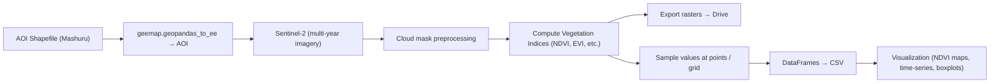

[](https://github.com/topics/remote-sensing)
[](https://github.com/topics/earth-engine)
[](https://github.com/topics/sentinel-2)
[](https://github.com/topics/vegetation-indices)
[](https://github.com/topics/gis)
[](https://github.com/topics/geemap)
[](https://github.com/topics/python)

# Dynamics of Irrigated Farmlands - Project Mashuru: Vegetation Monitoring using Sentinel-2

This project focuses on monitoring vegetation dynamics in **Mashuru, Kenya** using **Sentinel-2 imagery** and vegetation indices derived in **Google Earth Engine (GEE)**.  

It automates the retrieval of indices, exports data for analysis, and produces visualizations to better understand vegetation health and land surface changes in the area of interest.

> Notebook: `Project_Mashuru.ipynb`

---

##  Highlights

- **AOI:** Mashuru region, Kenya (digitized shapefile uploaded to GEE)  
- **Indices calculated:** NDVI, SAVI, MSAVI, OSAVI, LAI, RGI  
- **Timeframe:** Multi-year Sentinel-2 imagery composites  
- **Workflow:**
  - Cloud masking & Sentinel-2 preprocessing  
  - Vegetation index computation  
  - Sampling at reference points / grids  
  - Export of rasters & tabular data  
  - Visualization (NDVI maps, time-series plots)  

---

##  Method Overview


---
**Project Structure**
```bash
/
├─ Project_Mashuru.ipynb    # main workflow notebook
├─ data/
│  ├─ Mashuru_AOI.shp ...   # AOI shapefile
│  └─ Sample_points.csv     # points for sampling vegetation indices
└─ outputs/
   ├─ VI_Exports/           # exported rasters (GeoTIFFs)
   ├─ df_Mashuru.csv        # stacked vegetation index values
   └─ figures/              # NDVI maps, time-series plots
```
