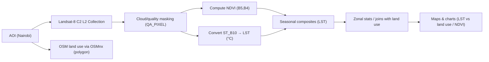

[](https://github.com/topics/gis)
[](https://github.com/topics/remote-sensing)
[](https://github.com/topics/landsat-8)
[](https://github.com/topics/urban-heat-island)
[](https://github.com/topics/earth-engine)
[](https://github.com/topics/osmnx)
[](https://github.com/topics/python)

# Urban Heat Island (UHI) Analysis & Mitigation Planner - Nairobi

This project maps **Urban Heat Island (UHI)** patterns for **Nairobi** using **Landsat-8 Collection 2 Level-2** surface temperature (**`ST_B10`**) in **Google Earth Engine (GEE)**, derives **NDVI**, and relates LST to **land-use classes** fetched from **OpenStreetMap** via **osmnx**. Seasonal summaries are produced to reflect Nairobi’s **long rains**, **short rains**, and **dry seasons**, followed by basic correlation/visual checks and a mitigation planning sketch.

> Notebook: `UHI_Analysis_Updated.ipynb`

---

##  Highlights

- **AOI:** Nairobi polygon (defined in-notebook)
- **Satellite:** Landsat-8 C2 L2 (`LANDSAT/LC08/C02/T1_L2`)
- **Bands / Indices:**
  - **LST** from **`ST_B10`** (scaled to Kelvin, then °C)
  - **NDVI** from B5 (NIR) & B4 (Red)
- **Seasons considered:**  
  - Long rains (Mar–May), Short rains (Oct–Dec), Dry seasons (Jan–Feb, Jun–Sep)
- **Land use:** Pulled from **OpenStreetMap** with **osmnx** (features by tags), simplified and grouped for analysis
- **Visuals:** Seasonal LST maps, NDVI maps, hot/cool spot perspectives; basic charts

---

##  Method Overview


---
**Project Structure**
```bash
/
├─ UHI_Analysis_Updated.ipynb     # main workflow
├─ data/
│  └─ (optional) local AOI/aux files if you export/import
└─ outputs/
   ├─ lst_maps/                   # seasonal LST rasters/figures
   ├─ ndvi_maps/                  # seasonal NDVI rasters/figures
   └─ uhi_stats.csv               # joined/zonal summaries (if saved)
```
---
##  Suggested Future Improvements

This project is **work in progress**. Possible enhancements include:

-  **Web App (Leafmap/Streamlit)**  
  Build a simple web application where users can:  
    - Draw or upload an AOI on an interactive map  
    - Select a season and year range  
    - Generate LST/NDVI composites on the fly via GEE  
    - View interactive maps and charts, with options to download PNG/CSV  

-  **Multi-Sensor Integration**  
  Add **Landsat-9** data and harmonize across sensors to improve temporal consistency.  

-  **Urban Fabric Predictors**  
  Introduce indices such as NDBI, imperviousness (from ESA WorldCover or Dynamic World), and tree canopy density to explain LST variations.  

-  **Temporal Trend Analysis**  
  Extend the study over multiple years, applying methods like Theil–Sen or Mann–Kendall to map long-term UHI trends and identify warming hotspots.  

-  **Mitigation Scenarios**  
  Explore “what-if” cases such as increasing tree canopy by 10% or implementing cool roofs, and estimate their potential impact on LST.  
